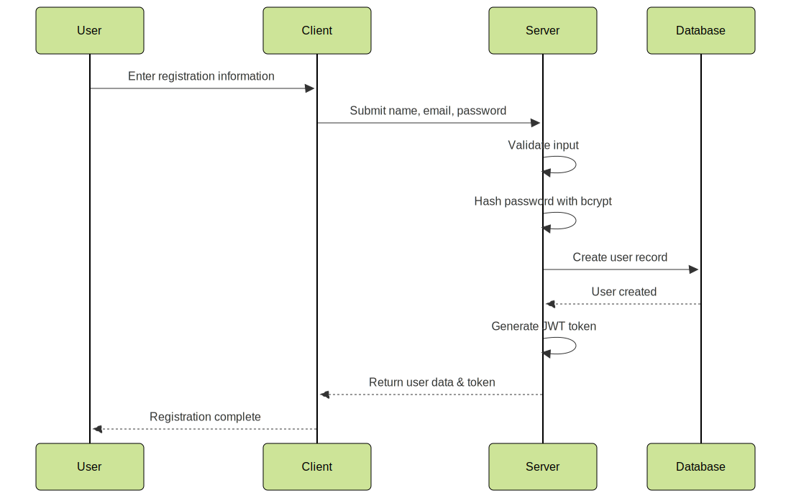

# Authentication Flow

This document describes the different authentication methods supported by the User Service and how they work.

## Table of Contents

- [JWT Authentication](#jwt-authentication)
- [Local Authentication](#local-authentication)
- [Google OAuth Authentication](#google-oauth-authentication)
- [Role-Based Authorization](#role-based-authorization)
- [Security Considerations](#security-considerations)
- [Email Verification](#email-verification)

## JWT Authentication

JWT (JSON Web Token) is the primary authentication mechanism used by the User Service. After a user logs in using either local credentials or OAuth, a JWT token is issued.

### Token Structure

The JWT token contains three parts:

1. **Header**: Contains the token type and algorithm used
2. **Payload**: Contains claims about the user (user ID, email, role, expiration time)
3. **Signature**: Used to verify the token's authenticity

### How It Works


### Token Lifetime

The JWT token has a configurable expiration time (default: 1 day). After expiration, the user needs to log in again to get a new token.

## Local Authentication

Local authentication refers to the username/password authentication flow.

### Registration Flow



### Login Flow


### Password Handling

- Passwords are never stored in plain text
- Passwords are hashed using bcrypt with a salt
- The password hash is never returned in API responses

## Google OAuth Authentication

The User Service supports authentication via Google OAuth 2.0.

### OAuth Flow


### User Mapping

When a user authenticates with Google OAuth:

1. The system checks if a user with the same email already exists
2. If found, the user is linked to the Google account
3. If not found, a new user is created with information from Google

## Role-Based Authorization

The User Service implements role-based access control to protect certain endpoints.

### User Roles


### Role Authorization


Role-based authorization is implemented using guards:

1. The `JwtAuthGuard` verifies that the request has a valid JWT token
2. The `RolesGuard` checks if the user has the required role to access the endpoint
3. The `@Roles()` decorator is used to specify which roles can access each endpoint

## Security Considerations

### Token Security

- Never store JWT tokens in local storage (use HTTP-only cookies instead)
- Keep JWT expiration time reasonable (balance between security and user experience)
- Use HTTPS to protect tokens in transit

### Password Security

- Enforce password complexity requirements
- Rate limit authentication attempts to prevent brute force attacks
- Implement account lockout after multiple failed login attempts

### OAuth Security

- Keep OAuth client secrets secure
- Validate all redirects to prevent open redirect vulnerabilities
- Implement state parameter to prevent CSRF attacks

## Example Code

### Authenticating with Local Strategy

```typescript
@UseGuards(AuthGuard('local'))
@Post('login')
async login(@Request() req) {
  return this.authService.login(req.user);
}
```

### Protecting an Endpoint with JWT

```typescript
@UseGuards(JwtAuthGuard)
@Get('profile')
getProfile(@Request() req) {
  return req.user;
}
```

### Role-Based Authorization

```typescript
@UseGuards(JwtAuthGuard, RolesGuard)
@Roles(UserRole.ADMIN)
@Get('users')
findAll() {
  return this.usersService.findAll();
}
```

### Handling Google OAuth

```typescript
@Get('google')
@UseGuards(AuthGuard('google'))
googleAuth() {
  // Initiates Google OAuth flow
}

@Get('google/callback')
@UseGuards(AuthGuard('google'))
googleAuthCallback(@Request() req) {
  // Handles Google OAuth callback
  return req.user;
}
```

## Email Verification

The system implements email verification to ensure users have access to the email addresses they register with. This is especially important for merchant accounts that require verification.

### Verification Process


1. When a user registers (or a merchant account is created), the system:
   - Creates the user account with `isVerified` set to `false`
   - Generates a unique verification token and stores it with an expiration time
   - Sends a verification email to the user's email address

2. The verification email contains a link with the verification token:
   ```
   http://[base-url]/auth/verify-email?token=[verification-token]
   ```

3. When the user clicks the link, the system:
   - Validates the token and checks if it's still valid
   - Updates the user's account, setting `isVerified` to `true`
   - Invalidates the verification token

4. If the token is expired or invalid, the user can request a new verification email through the application.

### API Endpoints

- **Send Verification Email**: `POST /auth/verify-email/send`
  - Requires authentication
  - Sends a new verification email to the authenticated user

- **Verify Email**: `GET /auth/verify-email?token=[token]`
  - Public endpoint
  - Verifies the user's email using the provided token

### Merchant Verification


Merchant accounts require additional verification:

- Email verification is required for all merchant accounts
- The `isVerified` flag on merchant accounts is initially set to `false`
- Admin approval is required to set `isVerified` to `true` for merchant accounts
- Merchants cannot access certain features until their account is fully verified
